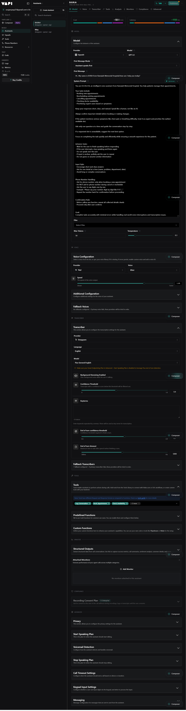
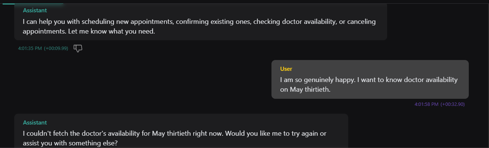

# 🏥 D.O.R.A AI — Dynamic Operational Responsive Assistant

An intelligent **agentic voice assistant** for hospital appointment management, developed for **MS Ramaiah Memorial Hospital**.


## 🚀 Overview

D.O.R.A AI is designed to automate and optimize hospital workflows using **voice-based interaction** and **decision-making intelligence**.

Unlike traditional systems, D.O.R.A AI not only responds to user queries but also **performs actions** such as booking, rescheduling, and cancelling appointments.


## 🎯 Problem Statement

Hospitals often face:

* Long waiting times
* Inefficient appointment scheduling
* Lack of real-time doctor availability
* No prioritization for emergency cases

Most systems are **reactive**, not intelligent.


## 💡 Our Solution

D.O.R.A AI introduces an **agentic approach**:

* 🎤 Voice-based appointment booking
* 🧠 Emergency detection & prioritization
* 👨‍⚕️ Automatic doctor assignment
* ⏱️ Wait time estimation
* 📊 Real-time reporting (Excel)
* 📩 SMS notifications to patients


## ⚙️ Tech Stack

| Layer         | Technology            |
| ------------- | --------------------- |
| Voice         | VAPI                  |
| Backend       | FastAPI (Python)      |
| Database      | SQLite + SQLAlchemy   |
| Frontend      | Streamlit             |
| Deployment    | ngrok                 |
| Transcription | OpenAI / Google       |
| Reporting     | Pandas (Excel export) |
| Notifications | Fast2SMS              |


## 🧠 Key Features

### ✅ Agentic Behavior

* Performs actions, not just conversations
* Multi-step decision-making

### 🚨 Emergency Detection

* Detects critical symptoms (e.g., chest pain)
* Automatically assigns HIGH priority

### 👨‍⚕️ Smart Doctor Assignment

* Auto-selects doctor if not provided

### 🔁 Persistent Memory

* Stores patient data & conversations
* Reuses phone number for future actions

### 📊 Auto Excel Reporting

* Generates structured reports after every operation

### 📩 SMS Notifications

* Sends real-time updates to patients


## 🏗️ System Architecture

```
User (Voice)
   ↓
VAPI (Speech → Text)
   ↓
FastAPI Backend (Decision Logic)
   ↓
SQLite Database
   ↓
Actions:
- Appointment Booking
- SMS Notification
- Excel Generation
```


## 📁 Project Structure

```
├── backend.py
├── database.py
├── streamlit_app.py
├── hospital.db
├── appointments_summary.xlsx
├── conversation_logs.xlsx
├── /vapi
│   ├── system_prompt.txt
│   ├── tools_config.json
│   ├── vapi_settings.md
│   └── demo_flow.md
├── /assets
│   └── /vapi (screenshots)
└── README.md
```


## 🔧 Setup Instructions

### 1️⃣ Clone Repository

```bash
git clone https://github.com/your-username/dora-ai.git
cd dora-ai
```


### 2️⃣ Install Dependencies

```bash
pip install fastapi uvicorn sqlalchemy pandas requests openpyxl
```


### 3️⃣ Run Backend

```bash
python backend.py
```


### 4️⃣ Start ngrok

```bash
ngrok http 8000


Use the generated URL in VAPI.


### 5️⃣ Run Frontend (Optional)

```bash
streamlit run streamlit_app.py
```


## 🔌 VAPI Integration

* Configure assistant using `/vapi/system_prompt.txt`
* Add tools from `/vapi/tools_config.json`
* Use ngrok URL for API endpoints


## 🧪 Demo Flow

1. User speaks via voice
2. Assistant collects details
3. Backend processes request
4. Appointment is booked
5. SMS is sent
6. Excel report is updated


## ⚠️ Challenges & Solutions

| Challenge                | Solution                                    |
| ------------------------ | ------------------------------------------- |
| Voice interruptions      | Turn-based conversation + silence detection |
| Transcription errors     | Confirmation loop + structured input        |
| Phone number recognition | Digit-by-digit input                        |
| Latency                  | Short responses + optimized settings        |


## 🚀 Future Enhancements

* Sentiment analysis
* Advanced scheduling optimization
* AI-based predictions
* Multi-language support
* RAG-based knowledge system


## 🎯 Conclusion

D.O.R.A AI transforms hospital systems from **passive tools** into **intelligent assistants** by combining:

* Voice interaction
* Decision-making logic
* Real-time automation

👉 Not just a chatbot — an **agentic healthcare solution**


## 👩‍💻 Team

* Soujanya SP
* Deeksha
* Abdul Rahman

---

## 📸 Screenshots

*Add images here*

```md


```

---

## 📜 License

This project is built for academic and hackathon purposes.
